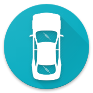
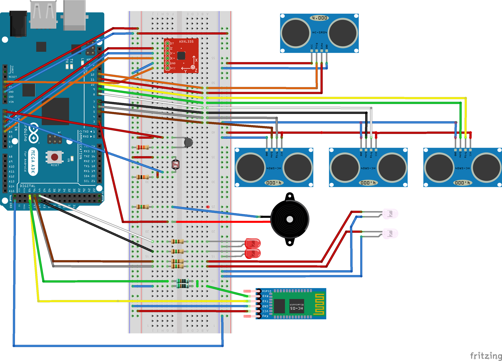
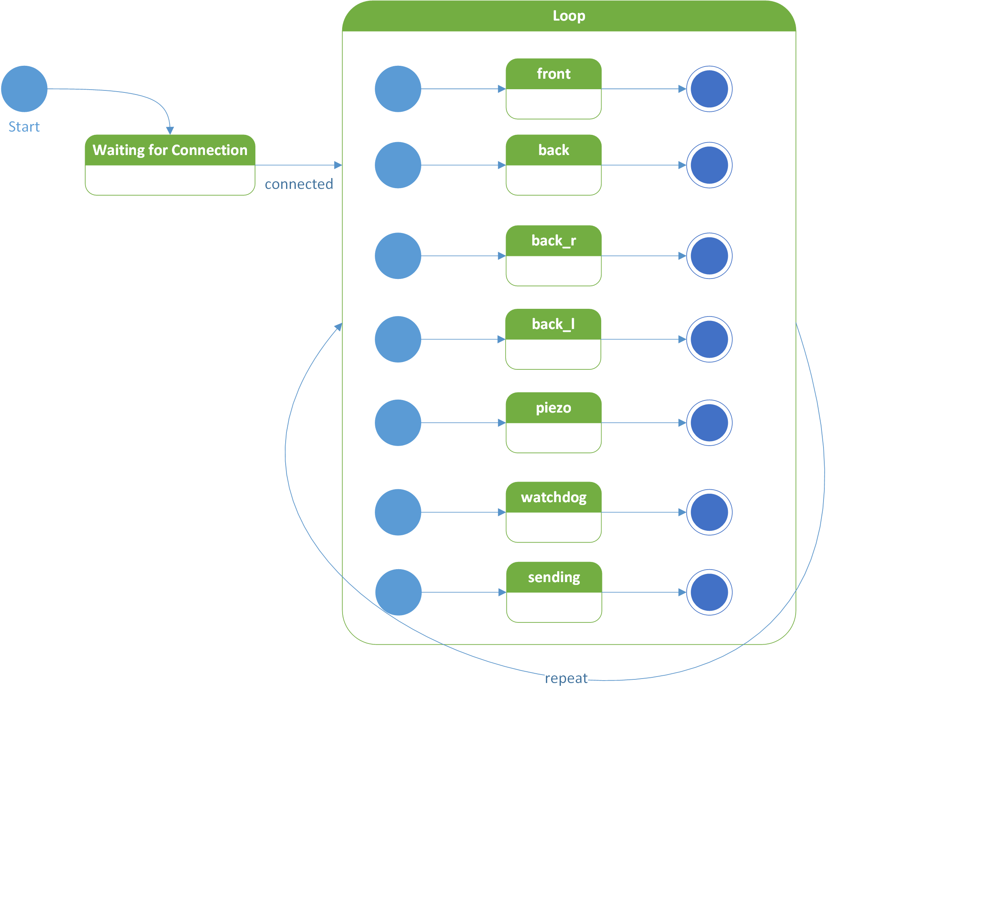
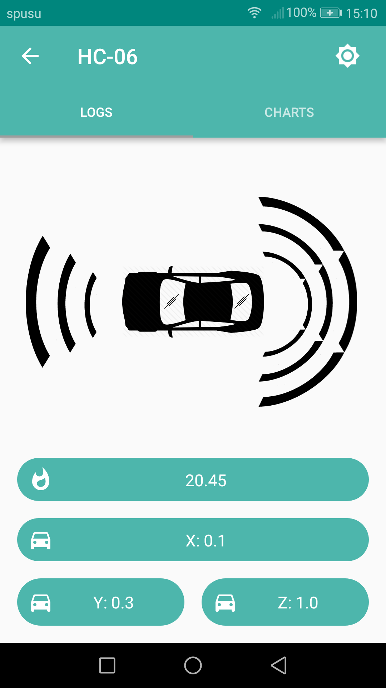
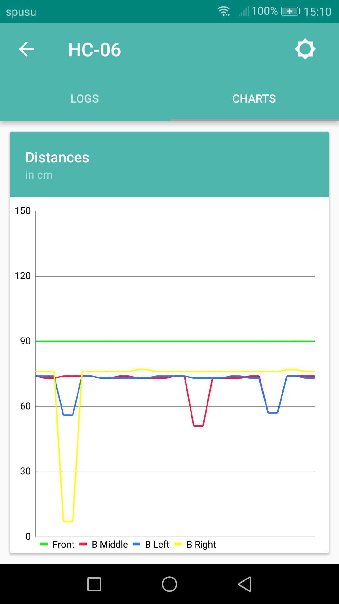
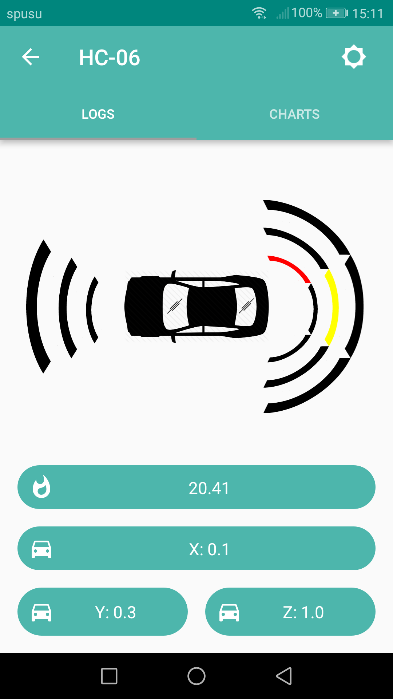
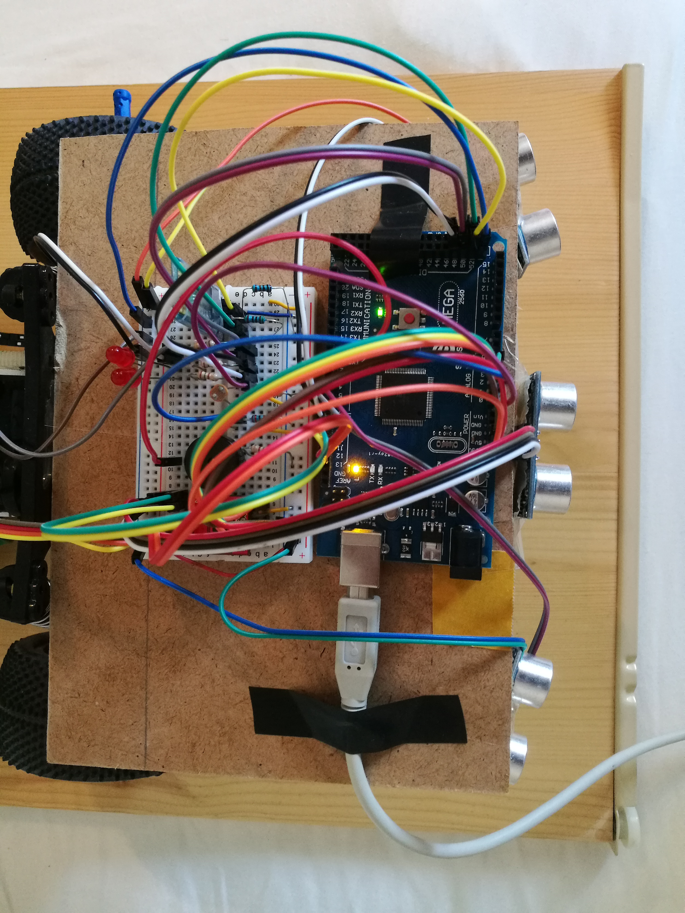
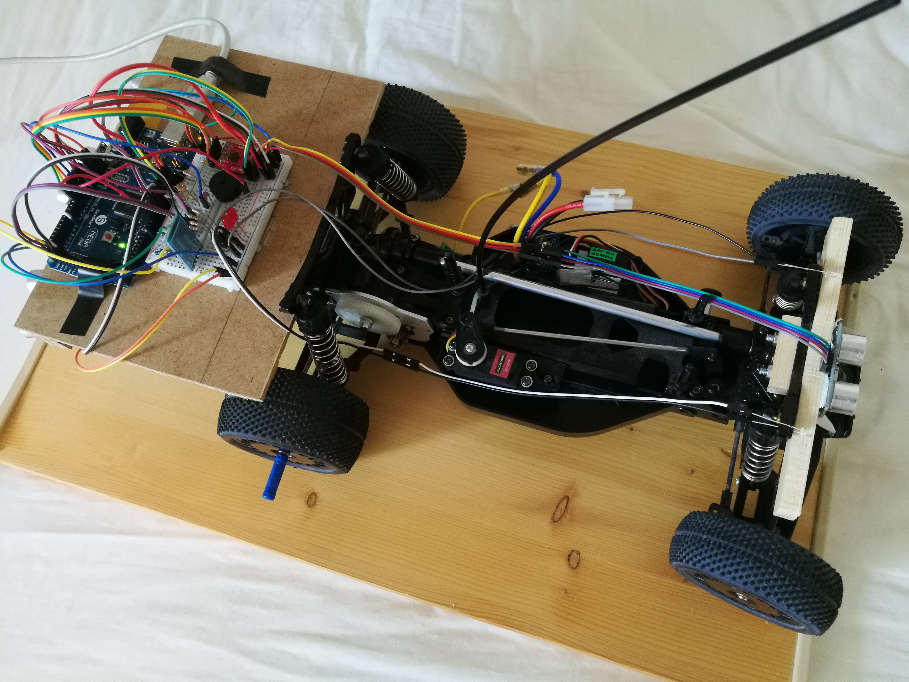

  

---

# Park Assistant for RC-Car

The idea of this project is, to build a parking aid system for a small RC car. Parking aids are advanced driver assistance systems designed to make parking easier. Such systems monitor an area of between roughly 20 and 180 cm in front of and behind the vehicle and warn the driver about any obstacles. 

Furthermore, sharp changes in the acceleration which indicates emergency brakes shall be detected and shown via led indication. An additional feature is the automatic light which turns on, when it gets dark and dizzy. Also, the temperature is measured, which could be used to overwatch the battery temp of the RC car. After capturing the sensor data by our board, it gets send to a smartphone app which visualizes the data. 

The distance sensors for the actual parking procedure have been implemented with ultrasonic sensors. However, the detailed hardware description can be found in the following sections. 

## Hardware
The picture below shows the complete circuit of the complete experiment. For the obstacle detection multiple ultrasonic sensors have been used whereby three were placed in the back and one in the front of the car. Furthermore, as already mentioned, the acceleration is recorded in order to react to emergency breaks. The piezo signalizes obstacles in the way and adjust its sound based on the distance to the respective objects. The light sensor is used in order to automatically activate the lights of the car. The bluetooth module connects to the Android application to visualize the data sensed. 

## Implementation 
For starting up the sensors/Arduino, just connect the USB cable to a USB port with 5V, 1A output.  The Arduino now is in an idle state and waits for the Bluetooth module to be connected to a respective device via the provided android application. After successfully connecting, the main routine starts. In this routine, Arduino threads  are started which handle basically all sensor in “parallel”. This Library helps to maintain organized and to facilitate the use of multiple tasks. We can use Timers Interrupts, and make it powerful, running "pseudo-background" tasks under the rug. 

While the read sensor values are updated in the background, the Bluetooth sending routine is handled in the loop method. For sending data, data are kept in packages with start and stop byte, command byte and separators. Therefore, it is easier for the android application to parse the data and visualize them. 

### Arduino Threads
As mentioned above, the states are run in “pseudo” parallelism and therefore the UML state chart looks like this. The states front, back, back_r and back_l describes the ultrasonic sensors. The sensor values are fetched in these states. The piezo state checks permanently if an obstacle is to close to the RC car and signalizes the distance via varying sounds. The Watchdog permanently checks the Bluetooth connection and resets the board if no response is received from the android application. The sending routine basically just formats all the data into packages and passes them to the Bluetooth module.  

### Protocol 

To send data over Bluetooth, an Android client has been used on the other side of communication. The android app receives the data and tries to parse them. In every message, a command is specified to signalize how the data should be parsed. 

The protocol looks as follows: 

-	Start Byte “$”
-	Command Byte “[1-5]:”
-	Separator “;”
-	Data 
-	End Byte “*”
---
If the message is received and parsed correctly, the Android application answers with ACK otherwise with NACK. 
-	ACK “|”
-	NACK “?”

## Android Application

  
  

  
  

## RC-Car 

  
  

